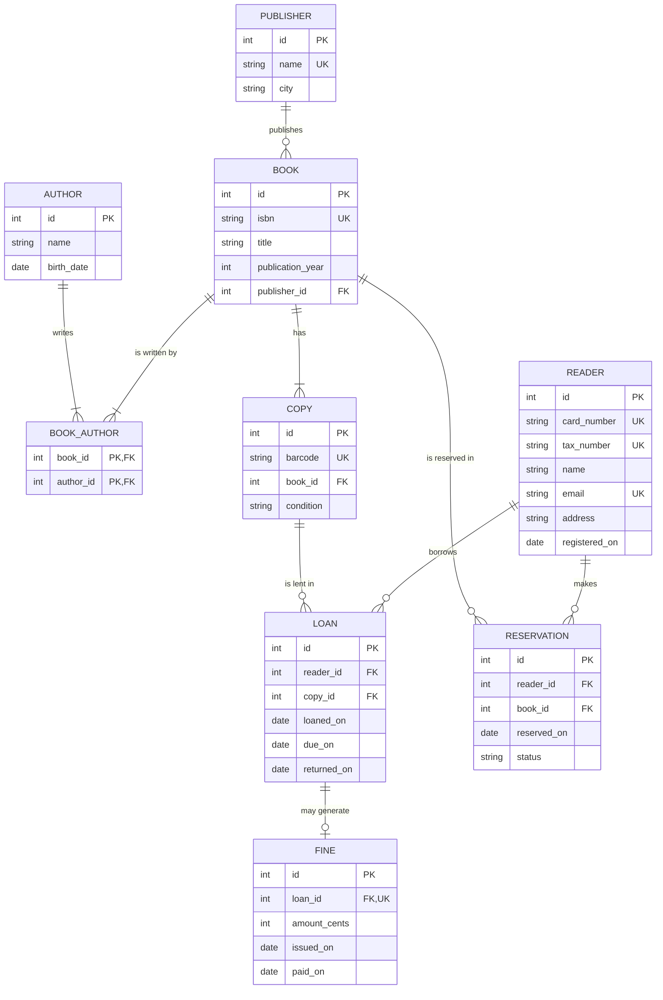

```mermaid
erDiagram
    PUBLISHER ||--o{ BOOK : publishes
    BOOK ||--|{ BOOK_AUTHOR : "is written by"
    AUTHOR ||--|{ BOOK_AUTHOR : writes
    BOOK ||--|{ COPY : "has"
    READER ||--o{ LOAN : borrows
    COPY ||--o{ LOAN : "is lent in"
    READER ||--o{ RESERVATION : makes
    BOOK ||--o{ RESERVATION : "is reserved in"
    LOAN ||--o| FINE : "may generate"
 
    PUBLISHER {
        int id PK
        string name UK
        string city
    }
    BOOK {
        int id PK
        string isbn UK
        string title
        int publication_year
        int publisher_id FK
    }
    AUTHOR {
        int id PK
        string name
        date birth_date
    }
    BOOK_AUTHOR {
        int book_id PK, FK
        int author_id PK, FK
    }
    COPY {
        int id PK
        string barcode UK
        int book_id FK
        string condition
    }
    READER {
        int id PK
        string card_number UK
        string tax_number UK
        string name
        string email UK
        string address
        date registered_on
    }
    LOAN {
        int id PK
        int reader_id FK
        int copy_id FK
        date loaned_on
        date due_on
        date returned_on
    }
    RESERVATION {
        int id PK
        int reader_id FK
        int book_id FK
        date reserved_on
        string status
    }
    FINE {
        int id PK
        int loan_id FK, UK
        int amount_cents
        date issued_on
        date paid_on
    }
```